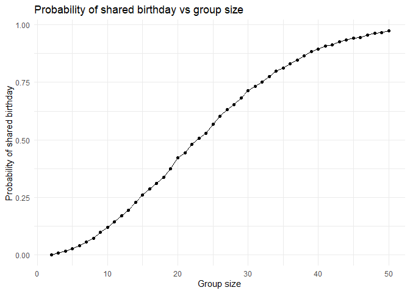
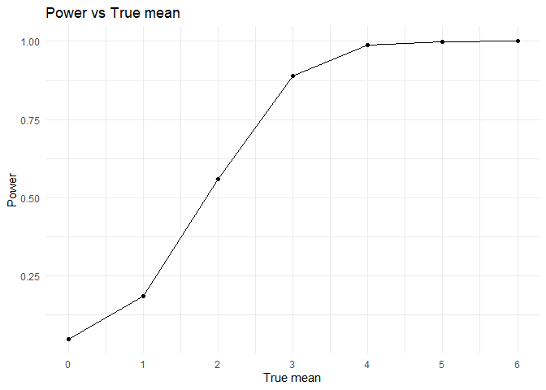
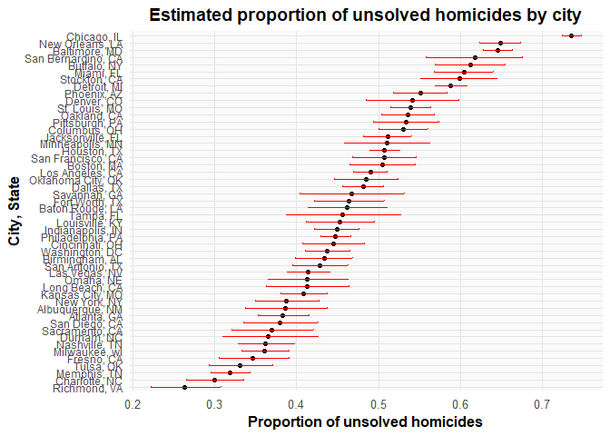

Homework 5 solutions
================
Yue Ge
2024-11-15

# Problem 1

Write a function that, for a fixed group size, randomly draws
“birthdays” for each person; checks whether there are duplicate
birthdays in the group; and returns TRUE or FALSE based on the result.

``` r
check_duplicate_birthday =
  function(n) {
    
  birthdays = sample(1:365, n, replace = TRUE)
  
  any(duplicated(birthdays))
}
```

Next, run this function 10000 times for each group size between 2 and
50. For each group size, compute the probability that at least two
people in the group will share a birthday by averaging across the 10000
simulation runs.

``` r
group_size = 2:50
rep_probability = numeric(length(group_size))

for (i in seq_along(group_size)) {
  
  n = group_size[i]
  
  output_rep = replicate(10000, check_duplicate_birthday(n))
  
  rep_probability[i] = mean(output_rep)
}
```

Make a plot showing the probability as a function of group size, and
comment on your results.

``` r
df_plot_prob = data.frame(groupsize = group_size, 
                  probability = rep_probability)

ggplot(df_plot_prob, aes(x = groupsize,
                 y = probability)) +
  geom_line() +
  geom_point() +
  labs(title = "Probability of shared birthday vs group size",
       x = "Group size",
       y = "Probability of shared birthday") +
  theme_minimal()
```

<!-- -->

*The probability that at least two people in the group will share a
birthday increases as the group size grows. Around a group size of 23,
the probability exceeds 50%.*

# Problem 2

Generate 5000 datasets.

``` r
sample = map(1:5000, ~ rnorm(n = 30, mean = 0, sd = 5))
```

For each dataset, save $\hat{\mu}$ and the p-value.

``` r
t_test = function(sample) {
  result = t.test(sample, alternative = "two.sided", conf.level = 0.95, mu = 0) %>% 
    broom::tidy() %>% 
    dplyr::select(estimate, p_value = p.value)
  return(result)
}

res_list <- map2(sample, 1:5000, ~ t_test(.x) %>%
                   mutate(iteration = .y))

mean_0 = bind_rows(res_list) %>%
  mutate(mean = 0, .before = 1) %>%
  dplyr::select(mean, iteration, everything())

mean_0
```

    ## # A tibble: 5,000 × 4
    ##     mean iteration estimate p_value
    ##    <dbl>     <int>    <dbl>   <dbl>
    ##  1     0         1 -0.191    0.833 
    ##  2     0         2  0.229    0.810 
    ##  3     0         3  0.0137   0.986 
    ##  4     0         4  1.18     0.215 
    ##  5     0         5  0.0844   0.937 
    ##  6     0         6 -0.00964  0.991 
    ##  7     0         7  0.228    0.811 
    ##  8     0         8 -0.00216  0.998 
    ##  9     0         9  1.23     0.243 
    ## 10     0        10  2.19     0.0446
    ## # ℹ 4,990 more rows

Repeat the above for μ = {1,2,3,4,5,6}, and complete the following:

``` r
t_test_new = function(mu) {
  sample = tibble(rnorm(n = 30, mean = mu, sd = 5))
  result = t.test(sample, alternative = "two.sided", conf.level = 0.95) %>% 
    broom::tidy() %>% 
    dplyr::select(estimate, p_value = p.value)
  return(result)
}

mean_1to6 <- expand_grid(mean = 1:6, iteration = 1:5000) %>% 
  mutate(result = map(mean,t_test_new)) %>% 
  unnest(result)

mean_0to6 = bind_rows(mean_0, mean_1to6)
```

Make a plot showing the proportion of times the null was rejected (the
power of the test) on the y axis and the true value of μ on the x axis.
Describe the association between effect size and power.

``` r
power_plot = mean_0to6 %>%
  group_by(mean) %>% 
  summarize(prop_rejected = sum(p_value < 0.05)/5000) %>% 
  ggplot(aes(x = mean,y = prop_rejected)) +
  geom_point() +
  geom_line() +
  scale_x_continuous(breaks = seq(0,6)) +
  labs(x = "True mean",y = "Power",title = "Power vs True mean") +
  theme_minimal()

power_plot
```

<!-- -->

*The association between effect size and power: As true mean increases,
the power also increases. In other words, the power increases as the
effect size increases, and ultimately approaches 1.*

Make a plot showing the average estimate of $\hat{\mu}$ on the y axis
and the true value of μ on the x axis.

``` r
estimate_mu = mean_0to6 %>%
  group_by(mean) %>% 
  summarize(ave_estimate = mean(estimate,na.rm = T), .group = 'drop')

avg_true_plot = estimate_mu %>%
  ggplot(aes(x = mean,y = ave_estimate)) +
  geom_point() +
  geom_line() +
  scale_x_continuous(breaks = seq(0,6)) + 
  scale_y_continuous(breaks = seq(0,6)) + 
  labs(x = "True mean",y = "Average estimate mean",title = "Average estimate mean vs True mean") +
  theme_minimal()

avg_true_plot
```

<!-- -->

*The average estimate mean is approximately equal to the true mean.*

Make a second plot (or overlay on the first) the average estimate of
*$\hat{\mu}$* only in samples for which the null was rejected on the y
axis and the true value of μ on the x axis. Is the sample average of
$\hat{\mu}$ across tests for which the null is rejected approximately
equal to the true value of μ? Why or why not?

``` r
estimate_mu_rej = mean_0to6 %>% 
  filter(p_value < 0.05) %>% 
  group_by(mean) %>% 
  summarize(ave_estimate = mean(estimate,na.rm = T), .groups = 'drop')

  
ggplot() +
  geom_line(data = estimate_mu, aes(x = mean, y = ave_estimate, color = "estimate_mu")) +
  geom_point(data = estimate_mu, aes(x = mean, y = ave_estimate, color = "estimate_mu")) +
  geom_line(data = estimate_mu_rej, aes(x = mean, y = ave_estimate, color = "estimate_mu_rej")) +
  geom_point(data = estimate_mu_rej, aes(x = mean, y = ave_estimate, color = "estimate_mu_rej")) +
  scale_x_continuous(breaks = seq(0,6)) +
  scale_y_continuous(breaks = seq(0,6)) +
  labs(x = "True mean",y = "Average estimate mean",title = "Total compared to rejected-only") +
  theme_minimal() +
  scale_color_manual(values = c("estimate_mu" = "blue", "estimate_mu_rej" = "red"))
```

<!-- -->

*When the true mean is between 1 and 4, the sample average of
$\hat{\mu}$ across tests for which the null is rejected are different
from true mean (always larger). This might be because of the small power
when effect size is small. When true mean is greater than 4, the average
estimate means of whose null are rejected are approximately equal to the
true mean.*

# Problem 3

``` r
homicide = read_csv("./data/homicide-data.csv")
```

    ## Rows: 52179 Columns: 12
    ## ── Column specification ────────────────────────────────────────────────────────
    ## Delimiter: ","
    ## chr (9): uid, victim_last, victim_first, victim_race, victim_age, victim_sex...
    ## dbl (3): reported_date, lat, lon
    ## 
    ## ℹ Use `spec()` to retrieve the full column specification for this data.
    ## ℹ Specify the column types or set `show_col_types = FALSE` to quiet this message.

``` r
head(homicide, 5)
```

    ## # A tibble: 5 × 12
    ##   uid   reported_date victim_last victim_first victim_race victim_age victim_sex
    ##   <chr>         <dbl> <chr>       <chr>        <chr>       <chr>      <chr>     
    ## 1 Alb-…      20100504 GARCIA      JUAN         Hispanic    78         Male      
    ## 2 Alb-…      20100216 MONTOYA     CAMERON      Hispanic    17         Male      
    ## 3 Alb-…      20100601 SATTERFIELD VIVIANA      White       15         Female    
    ## 4 Alb-…      20100101 MENDIOLA    CARLOS       Hispanic    32         Male      
    ## 5 Alb-…      20100102 MULA        VIVIAN       White       72         Female    
    ## # ℹ 5 more variables: city <chr>, state <chr>, lat <dbl>, lon <dbl>,
    ## #   disposition <chr>

*The dataset has 52179 rows and 12 columns. Each row is a homicide for
which we have the `date` when it was reported, the name, race, age, and
sex of the victim, the `city` and `state` in which it occured, etc.*

Create a city_state variable (e.g. “Baltimore, MD”) and then summarize
within cities to obtain the total number of homicides and the number of
unsolved homicides (those for which the disposition is “Closed without
arrest” or “Open/No arrest”).

``` r
homicide =
  homicide |>
  filter(!(city == "Tulsa" & state == "AL"))  # Remove the record with "Tulsa" as city and "AL" as state because there is not a Tulsa city in AL.

homicide = homicide %>%
  mutate(city_state = paste0(city, ", ", state)) 

homi_summary = homicide %>%
  group_by(city_state) %>%
  summarise(
    total_homicides = n(),
    unsolved_homicides = sum(disposition %in% c("Closed without arrest", "Open/No arrest"))
  )

homi_summary
```

    ## # A tibble: 50 × 3
    ##    city_state      total_homicides unsolved_homicides
    ##    <chr>                     <int>              <int>
    ##  1 Albuquerque, NM             378                146
    ##  2 Atlanta, GA                 973                373
    ##  3 Baltimore, MD              2827               1825
    ##  4 Baton Rouge, LA             424                196
    ##  5 Birmingham, AL              800                347
    ##  6 Boston, MA                  614                310
    ##  7 Buffalo, NY                 521                319
    ##  8 Charlotte, NC               687                206
    ##  9 Chicago, IL                5535               4073
    ## 10 Cincinnati, OH              694                309
    ## # ℹ 40 more rows

For the city of Baltimore, MD, use the prop.test function to estimate
the proportion of homicides that are unsolved; save the output of
prop.test as an R object, apply the broom::tidy to this object and pull
the estimated proportion and confidence intervals from the resulting
tidy dataframe.

``` r
baltimore = homi_summary %>%
  filter(city_state == "Baltimore, MD")
  
output_prop_test_bal = prop.test(x = pull(baltimore, unsolved_homicides), 
          n = pull(baltimore, total_homicides)) 

output_prop_test_bal %>% 
  broom::tidy() %>%
  select(estimate, conf.low, conf.high)
```

    ## # A tibble: 1 × 3
    ##   estimate conf.low conf.high
    ##      <dbl>    <dbl>     <dbl>
    ## 1    0.646    0.628     0.663

*Baltimore has an estimated 64.6% of its homicides unsolved.*

Now run prop.test for each of the cities in your dataset, and extract
both the proportion of unsolved homicides and the confidence interval
for each. Do this within a “tidy” pipeline, making use of purrr::map,
purrr::map2, list columns and unnest as necessary to create a tidy
dataframe with estimated proportions and CIs for each city.

``` r
output_prop_test_cities = homi_summary %>%
  mutate(prop_test = map2(unsolved_homicides, total_homicides, prop.test),
         output = map(prop_test, broom::tidy)) %>%
  unnest(cols = output) %>%
  select(city_state, estimate, conf.low, conf.high)
```

Create a plot that shows the estimates and CIs for each city – check out
geom_errorbar for a way to add error bars based on the upper and lower
limits. Organize cities according to the proportion of unsolved
homicides.

``` r
output_prop_test_cities %>%
  ggplot(aes(x = estimate, y = reorder(city_state, estimate))) +
  geom_point() + 
  geom_errorbar(aes(xmin = conf.low, xmax = conf.high), 
                width = 0.2, color="red") + # 
  labs(
    title = "Estimated proportion of unsolved homicides by city",
    x = "Proportion of unsolved homicides",
    y = "City, State"
  ) +
  theme_minimal(base_size = 12) + 
  theme(
    plot.title = element_text(size = 14, 
                              face = "bold",
                              hjust = 0.5), 
    axis.text.y = element_text(size = 9, 
                               color = "#4D4D4D"), 
    axis.text.x = element_text(size = 10,
                               color = "#4D4D4D"), 
    axis.title = element_text(face = "bold"), 
    panel.grid.major = element_line(color = "#E5E5E5"),
    panel.grid.minor = element_blank(), 
    panel.background = element_rect(fill = "#FAFAFA", 
                                    color = NA) 
  )
```

<!-- -->
